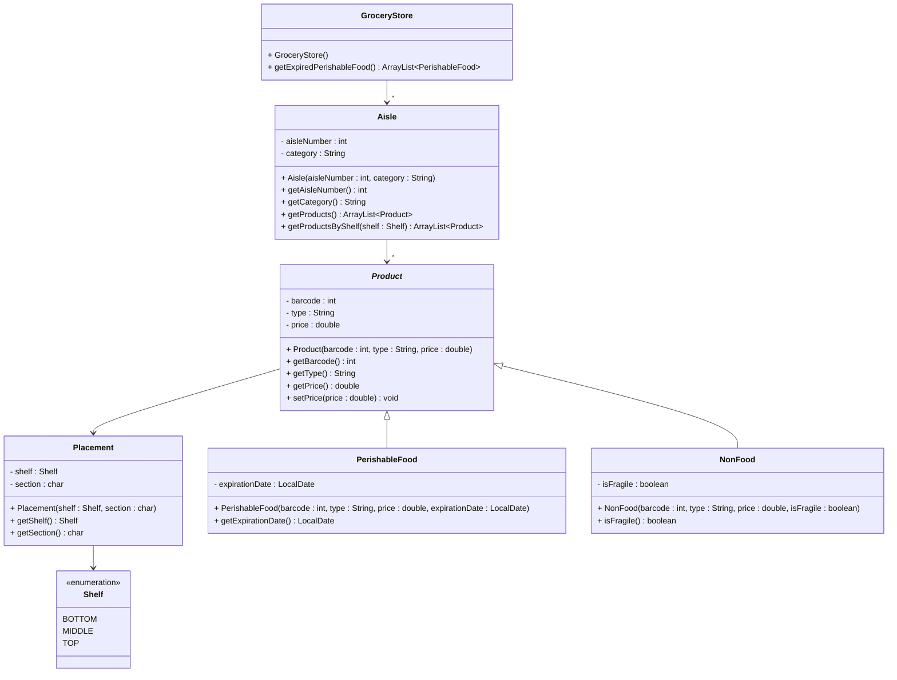

# Exercise 4 - Grocery Store System

Implement the following class diagram in Java:

## Notes:
- `section` is a single character (e.g., 'A', 'B', 'C') that represents a horizontal section within the aisle, allowing products to be organized both by shelf (vertical: BOTTOM, MIDDLE, TOP) and section (horizontal: A, B, C, etc.)
- `getProductsByShelf(shelf : Shelf)` returns all products in the aisle that are on the specified shelf
- Use `LocalDate.now()` to get the current date
- Use `java.time.LocalDate` for date handling
- Perishable food is expired if the expiration date is before the current date

