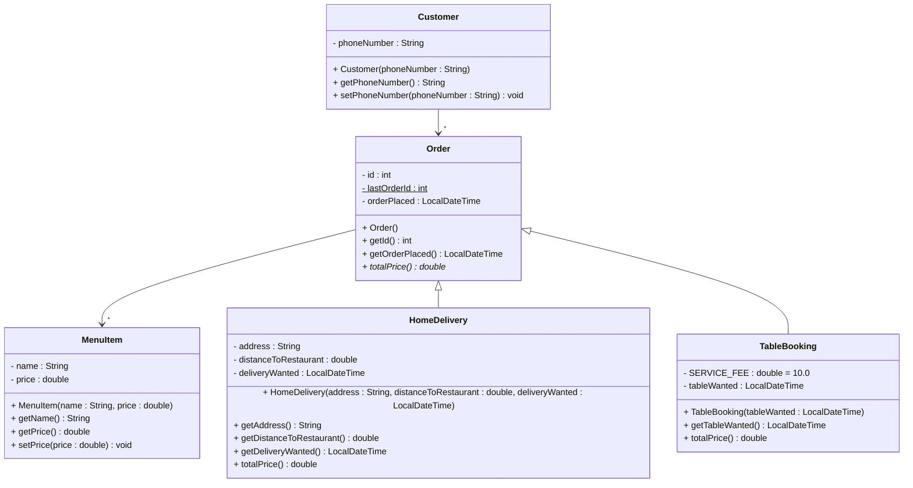

# Exercise 5 - Restaurant Order System

Implement the following class diagram in Java:

## Notes:
- When a new order is created its ID field should be the value of lastOrderId plus one, and then that value should be stored as lastOrderId
- `totalPrice()` in Order is abstract (marked with *)
- The added delivery fee is based on distance to the restaurant:
  - 0-5 km: 5 kr
  - 5-10 km: 12 kr
  - 10+ km: 25 kr
- `TableBooking.totalPrice()` = sum of menu items + SERVICE_FEE (10 kr)
- `HomeDelivery.totalPrice()` = sum of menu items + delivery fee (based on distance)
- Use `java.time.LocalDateTime` for date and time handling

