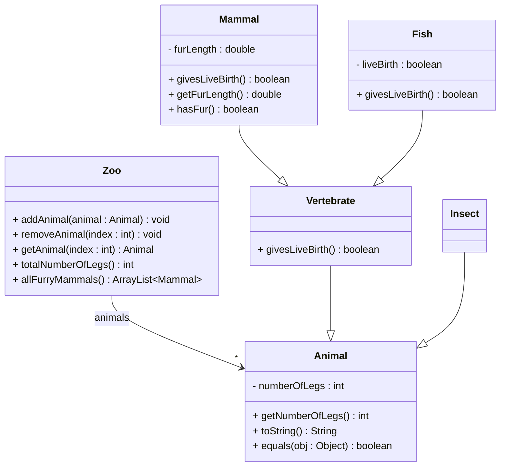

# Exercise 6 - Zoo System

Implement the following class diagram in Java:

```mermaid
classDiagram
    class Zoo {
        + addAnimal(animal : Animal) void
        + removeAnimal(index : int) void
        + getAnimal(index : int) Animal
        + totalNumberOfLegs() int
        + allFurryMammals() ArrayList~Mammal~
    }
    
    class Animal {
        - numberOfLegs : int
        + getNumberOfLegs() int
        + toString() String
        + equals(obj : Object) boolean
    }
    
    class Vertebrate {
        + givesLiveBirth() boolean
    }
    
    class Insect {
    }
    
    class Mammal {
        - furLength : double
        + givesLiveBirth() boolean
        + getFurLength() double
        + hasFur() boolean
    }
    
    class Fish {
        - liveBirth : boolean
        + givesLiveBirth() boolean
    }
    
    Zoo --> "*" Animal : animals
    Vertebrate --|> Animal
    Insect --|> Animal
    Mammal --|> Vertebrate
    Fish --|> Vertebrate
```

## Notes:
- Some fish (not all) gives livebirth
- This exercise does not require date handling

