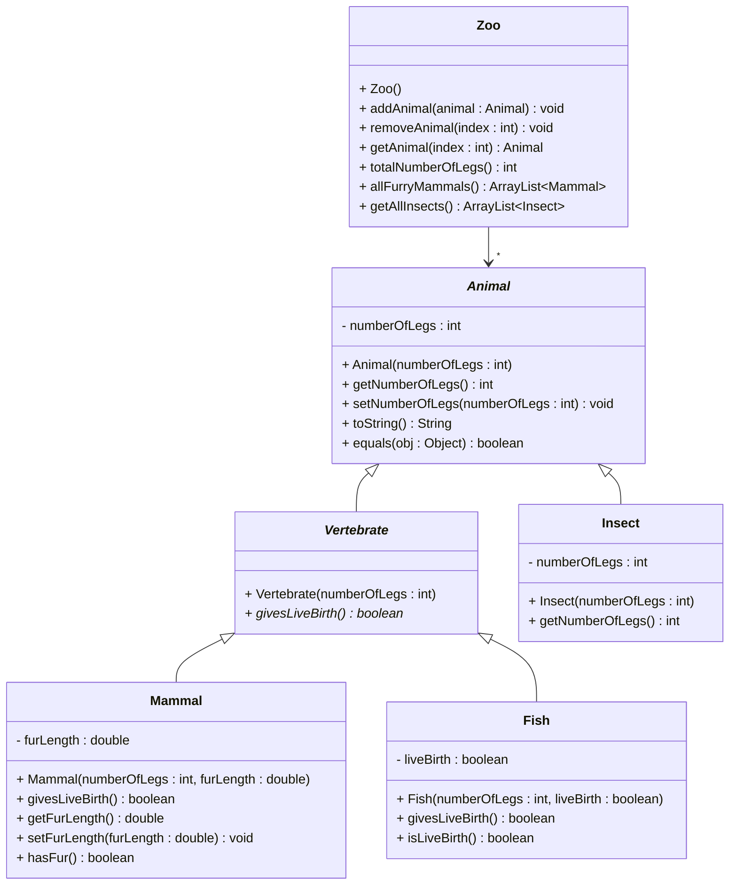

# Exercise 6 - Zoo System

Implement the following class diagram in Java:

## Notes:
- Some fish (not all) gives livebirth
- `getAllInsects()` returns all animals that are instances of the Insect class
- Fish typically have 0 legs
- Insects have 6 legs
- Mammals typically have 4 legs (but can vary)

