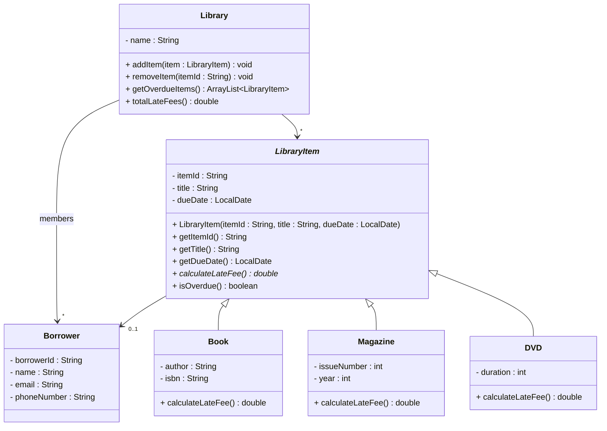

# Exercise 7 - Library System

Implement the following class diagram in Java:

## Notes:
- Books have a late fee of 2 kr per day overdue
- Magazines have a late fee of 1 kr per day overdue
- DVDs have a late fee of 5 kr per day overdue
- Use `java.time.LocalDate` for date handling
- Use `ChronoUnit.DAYS.between()` to calculate days between dates

