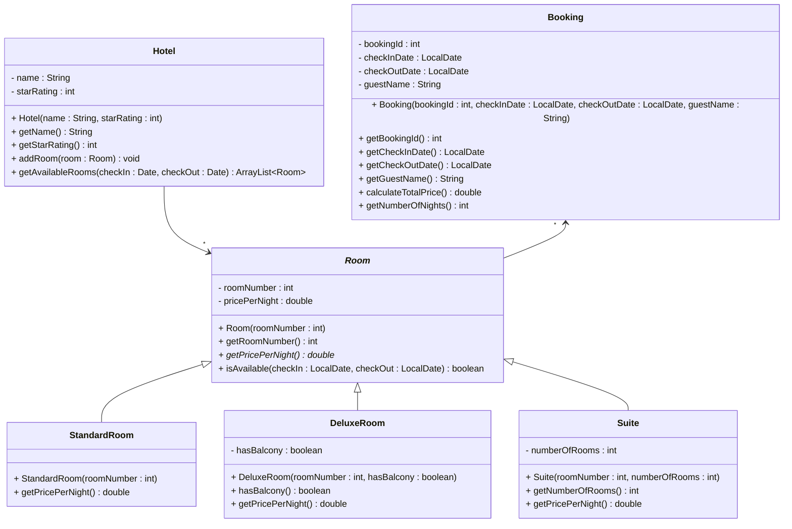

# Exercise 8 - Hotel Booking System

Implement the following class diagram in Java:

## Notes:
- Standard rooms cost 500 kr per night
- Deluxe rooms cost 800 kr per night, or 900 kr if they have a balcony
- Suites cost 1200 kr per night plus 200 kr for each additional room beyond the first
- Use `java.time.LocalDate` for date handling
- Use `ChronoUnit.DAYS.between()` to calculate number of nights

