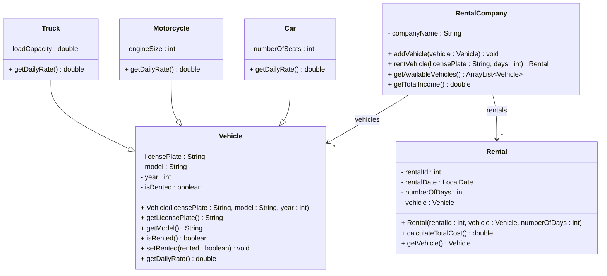

# Exercise 9 - Vehicle Rental System

Implement the following class diagram in Java:

## Notes:
- Cars cost 300 kr per day plus 50 kr for each seat beyond 4
- Motorcycles cost 200 kr per day plus 1 kr per cc of engine size
- Trucks cost 500 kr per day plus 100 kr per ton of load capacity
- Use `java.time.LocalDate` for date handling

