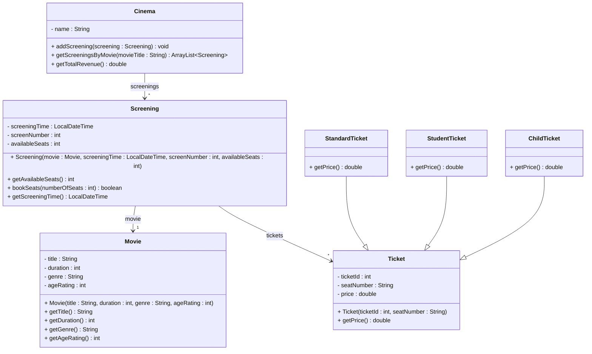

# Exercise 10 - Cinema Booking System

Implement the following class diagram in Java:

## Notes:
- Standard tickets cost 120 kr
- Student tickets cost 90 kr
- Child tickets cost 70 kr
- Use `java.time.LocalDateTime` for screening times

