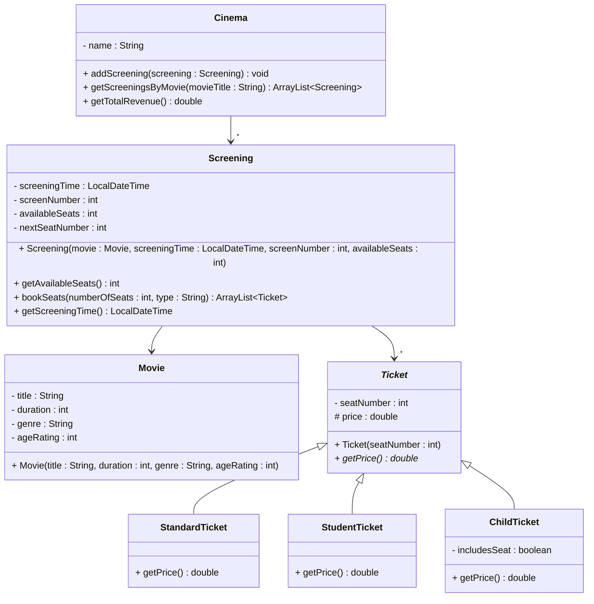

# Exercise 10 - Cinema Booking System

Implement the following class diagram in Java:

## Notes:
- Standard tickets cost 120 kr
- Student tickets cost 90 kr
- Child tickets cost 50 kr, but an extra 10 kr if a seat is included
- Use `java.time.LocalDateTime` for screening times
- The `bookSeats()` method should return an `ArrayList` of `Ticket` objects equal to the `numberOfSeats` requested
- The `type` parameter specifies the ticket type: "standard", "student", or "child"
- If there are not enough available seats, throw an `IllegalStateException`
- Seat numbers are auto-incremented integers starting from 1 for each screening

