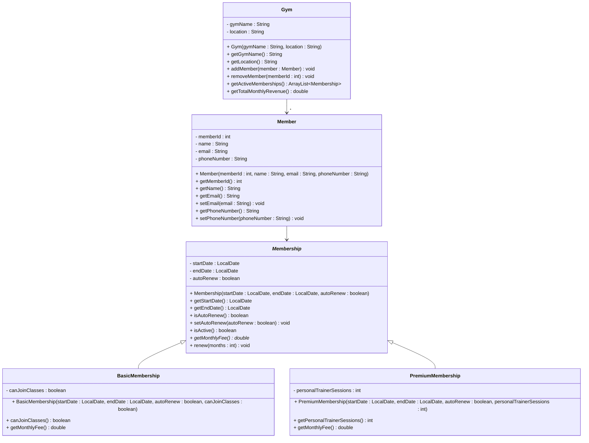

# Exercise 11 - Gym Membership System

Implement the following class diagram in Java:

## Notes:
- `getMonthlyFee()` in `Membership` is abstract (marked with *)
- Basic membership costs 299 kr per month, or 50% more if `canJoinClasses` is true
- Premium membership costs 499 kr per month plus 50 kr for each personal trainer session included
- `isActive()` returns true if the current date is between startDate and endDate
- Use `java.time.LocalDate` for date handling

