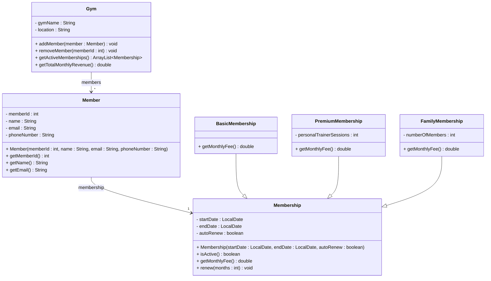

# Exercise 11 - Gym Membership System

Implement the following class diagram in Java:

## Notes:
- Basic membership costs 299 kr per month
- Premium membership costs 499 kr per month plus 50 kr for each personal trainer session included
- Family membership costs 199 kr per person per month
- Use `java.time.LocalDate` for date handling

