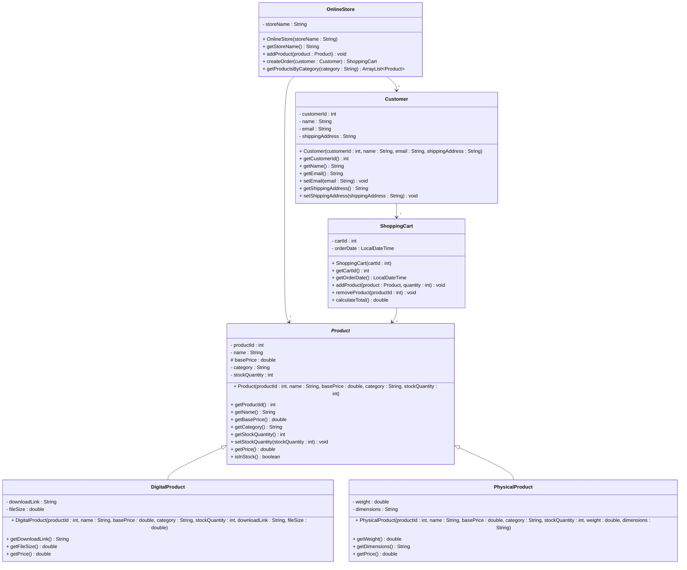

# Exercise 12 - Online Store System

Implement the following class diagram in Java:

## Notes:
- `getPrice()` in `Product` is abstract (marked with *)
- Digital products: `getPrice()` returns the base price (no additional costs)
- Physical products: `getPrice()` returns base price + shipping costs
  - Shipping costs: 50 kr for items under 1 kg, 100 kr for items 1-5 kg, 200 kr for items over 5 kg
- Use `java.time.LocalDateTime` for order timestamps
- `orderDate` is automatically set to the current date/time when a ShoppingCart is created

