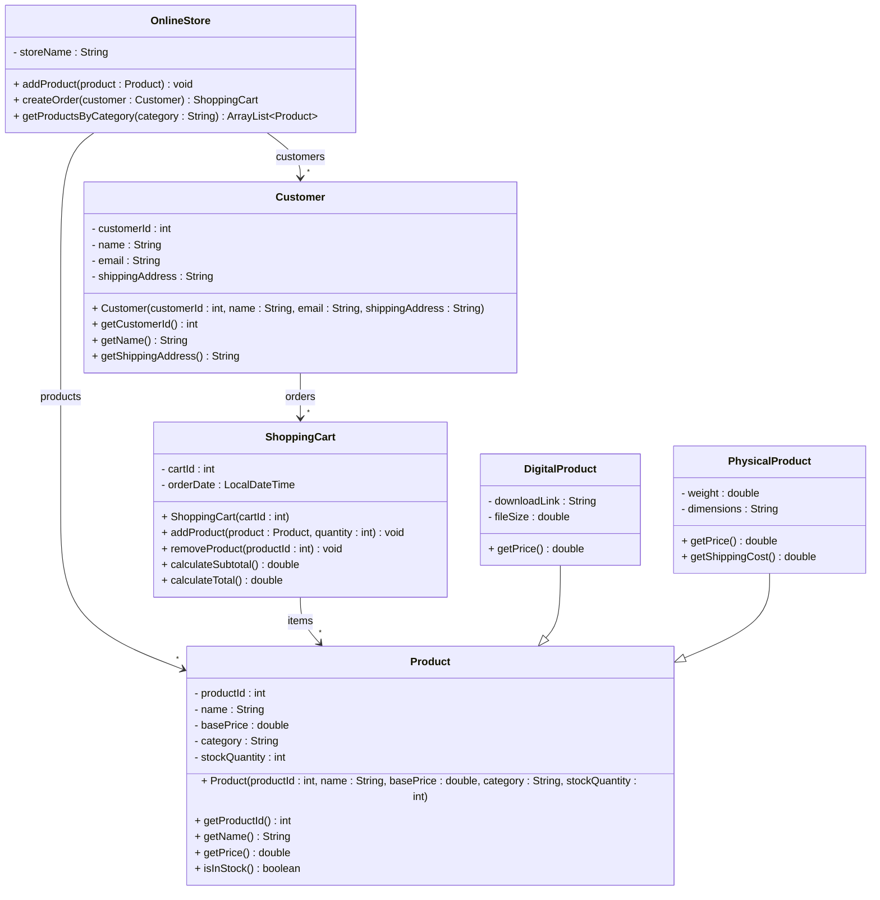

# Exercise 12 - Online Store System

Implement the following class diagram in Java:

## Notes:
- Digital products have no additional costs
- Physical products have shipping costs: 50 kr for items under 1 kg, 100 kr for items 1-5 kg, 200 kr for items over 5 kg
- Use `java.time.LocalDateTime` for order timestamps

