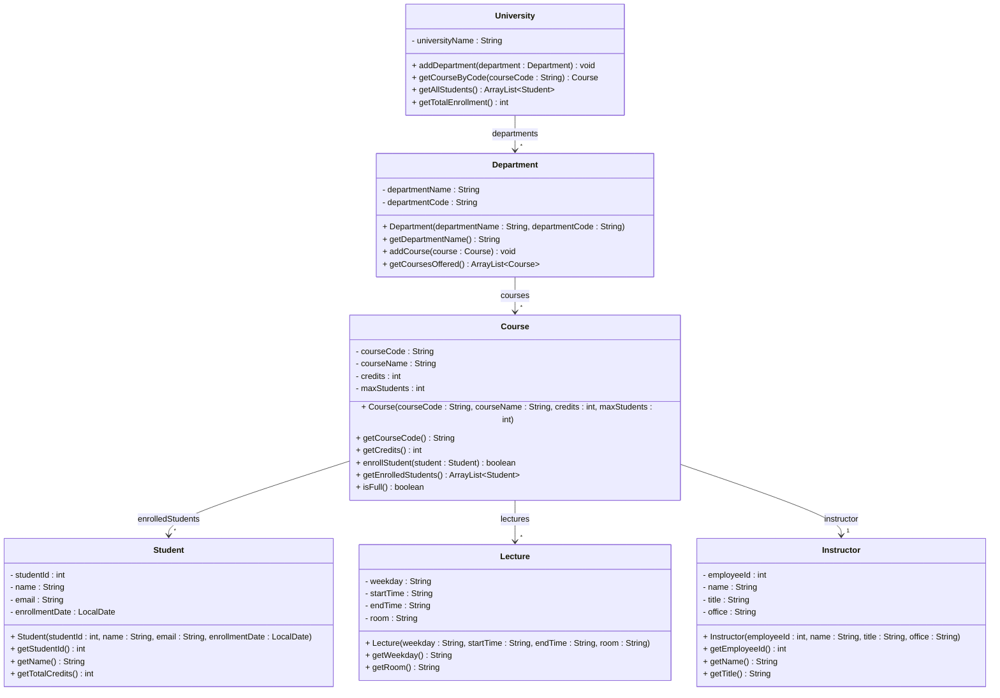

# Exercise 13 - University Course System

Implement the following class diagram in Java:

## Notes:
- Students cannot enroll in a course if it's full
- Use `java.time.LocalDate` for enrollment dates

