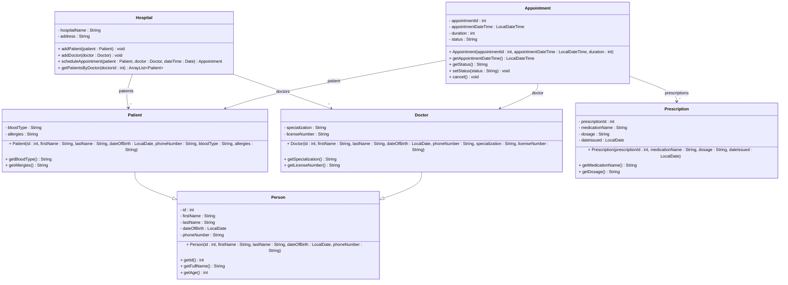

# Exercise 14 - Hospital Management System

Implement the following class diagram in Java:

## Notes:
- Use `java.time.LocalDate` for dates and `java.time.LocalDateTime` for appointment times
- Appointment status can be: "Scheduled", "Completed", "Cancelled"
- Use `Period.between()` to calculate age from date of birth

