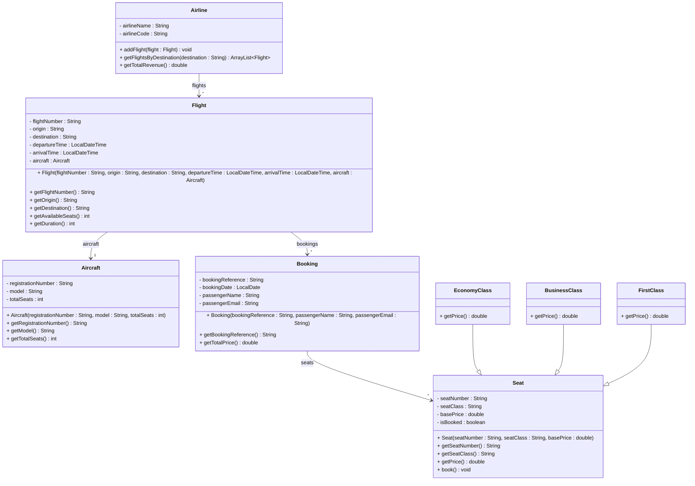

# Exercise 15 - Flight Booking System

Implement the following class diagram in Java:

## Notes:
- Economy class seats cost the base price
- Business class seats cost 2.5 times the base price
- First class seats cost 4 times the base price
- Use `java.time.LocalDateTime` for flight times and `java.time.LocalDate` for booking dates
- Use `Duration.between()` to calculate flight duration

