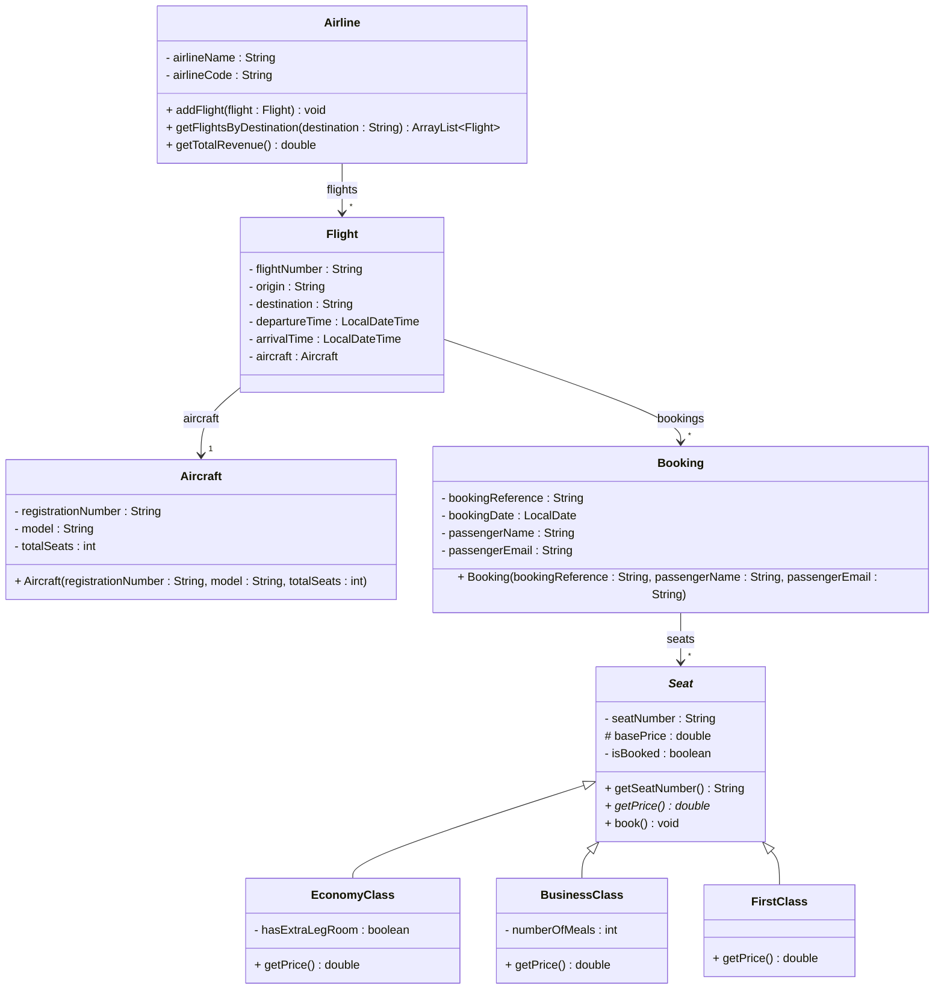

# Exercise 15 - Flight Booking System

Implement the following class diagram in Java:

## Notes:
- Economy class seats cost the base price, plus 50 kr extra if `hasExtraLegRoom` is true
- Business class seats cost 2.5 times the base price, plus 100 kr per meal (based on `numberOfMeals`)
- First class seats cost 4 times the base price
- Use `java.time.LocalDateTime` for flight times and `java.time.LocalDate` for booking dates
- Use `Duration.between()` to calculate flight duration
- The `getPrice()` method in `Seat` is abstract (marked with *)

