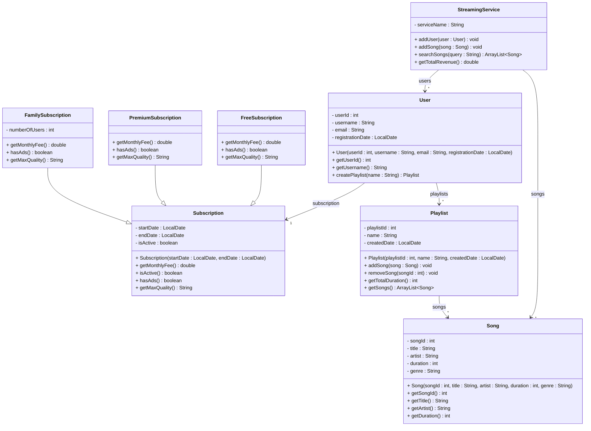

# Exercise 16 - Music Streaming System

Implement the following class diagram in Java:

## Notes:
- Free subscription costs 0 kr, has ads, max quality is 128 kbps
- Premium subscription costs 99 kr per month, no ads, max quality is 320 kbps
- Family subscription costs 149 kr per month for up to 6 users, no ads, max quality is 320 kbps
- Use `java.time.LocalDate` for date handling

