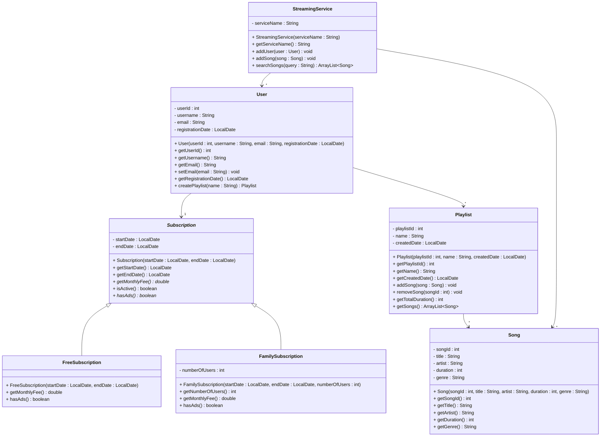

# Exercise 16 - Music Streaming System

Implement the following class diagram in Java:

## Notes:
- `getMonthlyFee()` and `hasAds()` in `Subscription` are abstract (marked with *)
- Free subscription costs 0 kr, has ads
- Family subscription costs 149 kr per month for up to 6 users, no ads
- `isActive()` returns true if the current date is between startDate and endDate
- Use `java.time.LocalDate` for date handling

