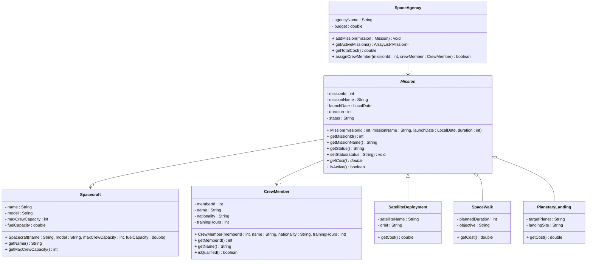

# Exercise 17 - Space Mission System

Implement the following class diagram in Java:

## Notes:
- Satellite deployment missions cost 500 million kr
- Space walk missions cost 200 million kr plus 10 million kr per hour of duration
- Planetary landing missions cost 2 billion kr for Mars, 5 billion kr for other planets
- Crew members need at least 1000 training hours to be qualified
- Mission status can be: "Planned", "Active", "Completed", "Aborted"
- Use `java.time.LocalDate` for launch dates

