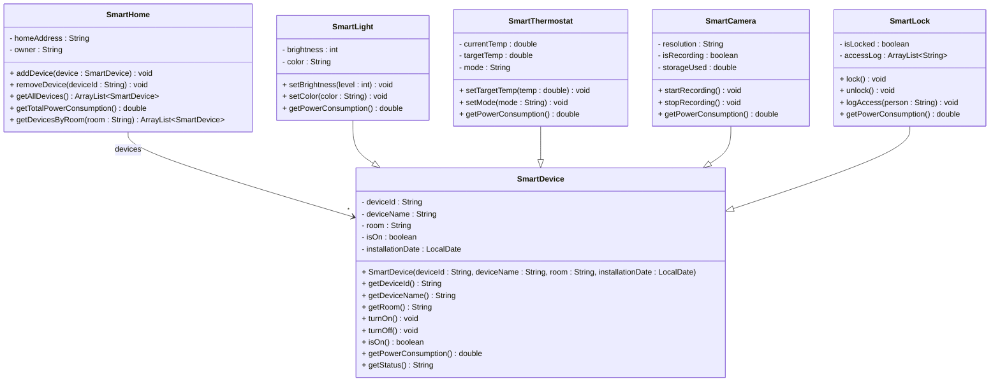

# Exercise 18 - Smart Home System

Implement the following class diagram in Java:

## Notes:
- Smart lights consume 10W when on, reduced by (100-brightness)/100
- Smart thermostats consume 500W when heating, 300W when cooling, 5W in standby mode
- Smart cameras consume 5W when off, 15W when recording
- Smart locks consume 2W continuously
- Use `java.time.LocalDate` for installation dates

