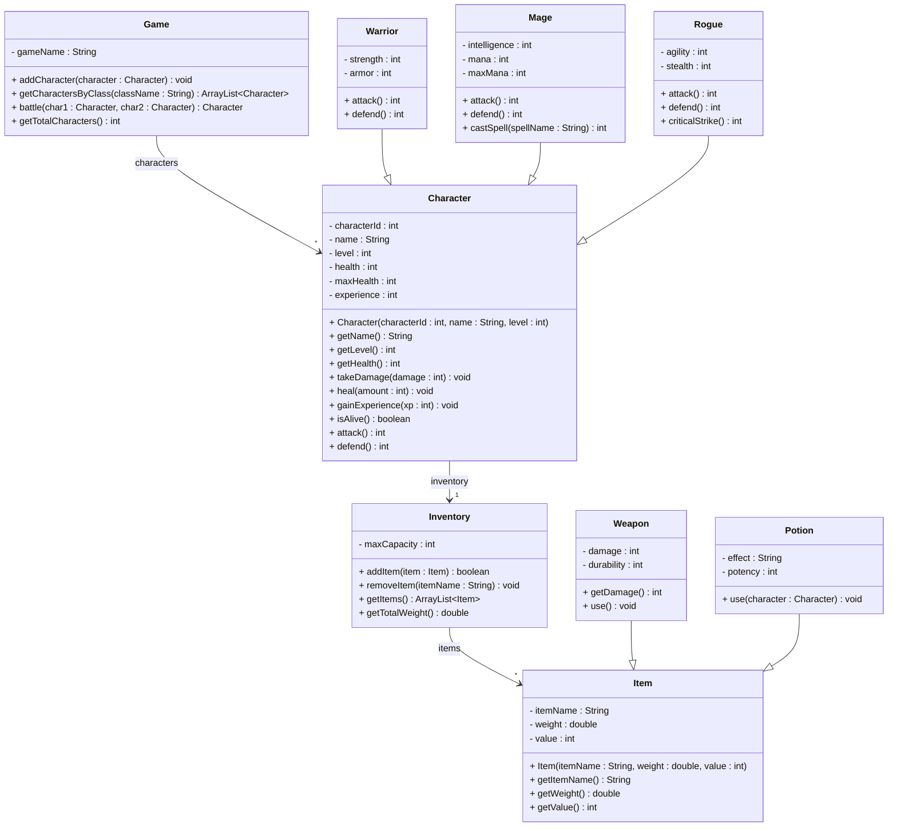

# Exercise 19 - Fantasy Game System

Implement the following class diagram in Java:

## Notes:
- Warriors attack with base damage = strength * 2 + armor
- Mages attack with base damage = intelligence * 3 (costs 10 mana)
- Rogues attack with base damage = agility * 2, critical strike does triple damage
- Warriors defend by reducing damage by armor value
- Mages defend by reducing damage by intelligence / 2
- Rogues defend by dodging (50% chance to take no damage based on agility)
- Characters level up every 100 experience points
- Health potions heal for their potency value, mana potions restore mana
- This exercise does not require date handling

