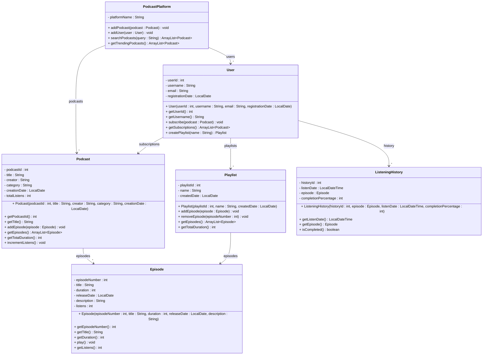

# Exercise 20 - Podcast Platform System

Implement the following class diagram in Java:

## Notes:
- Episodes are considered "completed" if completion percentage >= 90%
- Trending podcasts are those with more than 10000 total listens
- Duration is measured in seconds
- Use `java.time.LocalDate` for dates and `java.time.LocalDateTime` for listening timestamps

