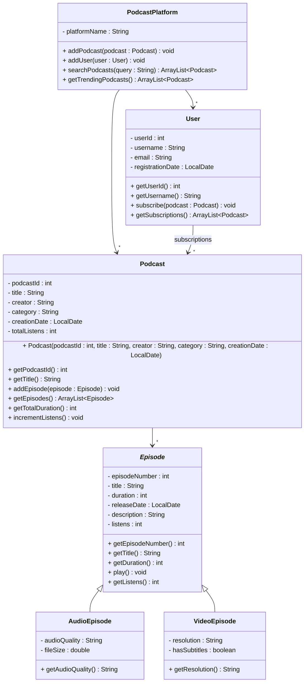

# Exercise 20 - Podcast Platform System

Implement the following class diagram in Java:

## Notes:
- `Episode` is abstract (marked with italic)
- Audio episodes can have quality settings like "128kbps", "256kbps", "320kbps"
- Video episodes can have resolutions like "720p", "1080p", "4K"
- Trending podcasts are those with more than 10000 total listens
- Duration is measured in seconds
- Use `java.time.LocalDate` for dates

