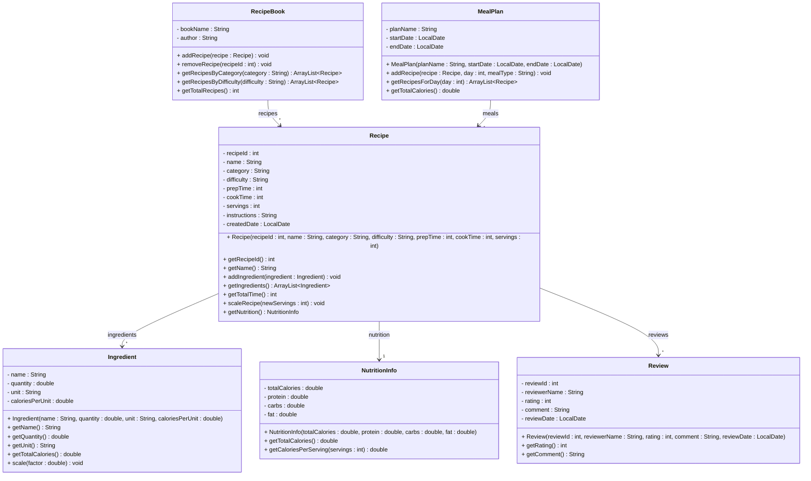

# Exercise 21 - Recipe Manager System

Implement the following class diagram in Java:

## Notes:
- Difficulty levels: "Easy", "Medium", "Hard"
- Meal categories: "Breakfast", "Lunch", "Dinner", "Dessert", "Snack"
- Times are measured in minutes
- Rating is from 1 to 5 stars
- Scaling a recipe multiplies all ingredient quantities by (newServings / currentServings)
- Use `java.time.LocalDate` for dates

