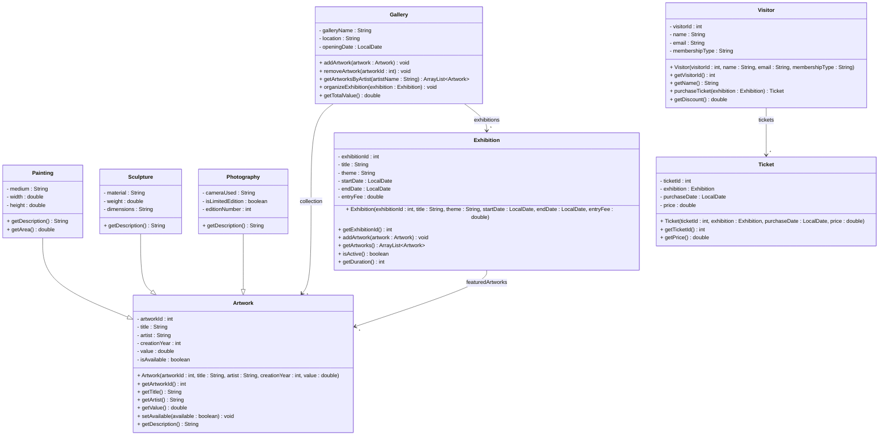

# Exercise 22 - Art Gallery System

Implement the following class diagram in Java:

## Notes:
- Painting description includes: "Painting by [artist], [width]x[height] cm, [medium]"
- Sculpture description includes: "Sculpture by [artist], [material], [weight] kg"
- Photography description includes: "Photo by [artist], [camera]" + " (Limited Edition X/Y)" if limited
- Regular visitors pay full price, Members get 20% discount, Premium members get 50% discount
- Exhibition is active if current date is between startDate and endDate
- Use `java.time.LocalDate` for dates and `ChronoUnit.DAYS.between()` for duration

