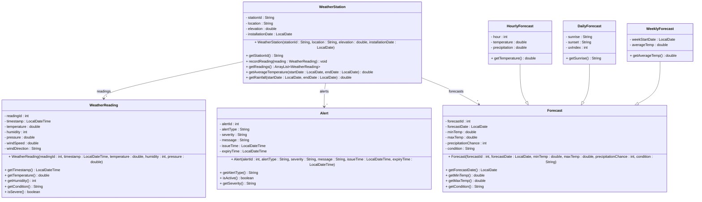

# Exercise 23 - Weather Station System

Implement the following class diagram in Java:

## Notes:
- Severe conditions: temperature > 35°C or < -20°C, wind speed > 100 km/h, pressure < 980 hPa
- Alert severity levels: "Low", "Moderate", "High", "Extreme"
- Alert types: "Storm", "Heat", "Cold", "Flood", "Wind"
- Conditions: "Sunny", "Cloudy", "Rainy", "Snowy", "Stormy", "Foggy"
- Temperature in Celsius, pressure in hPa (hectopascals), wind speed in km/h
- Use `java.time.LocalDate` and `java.time.LocalDateTime` for time handling

