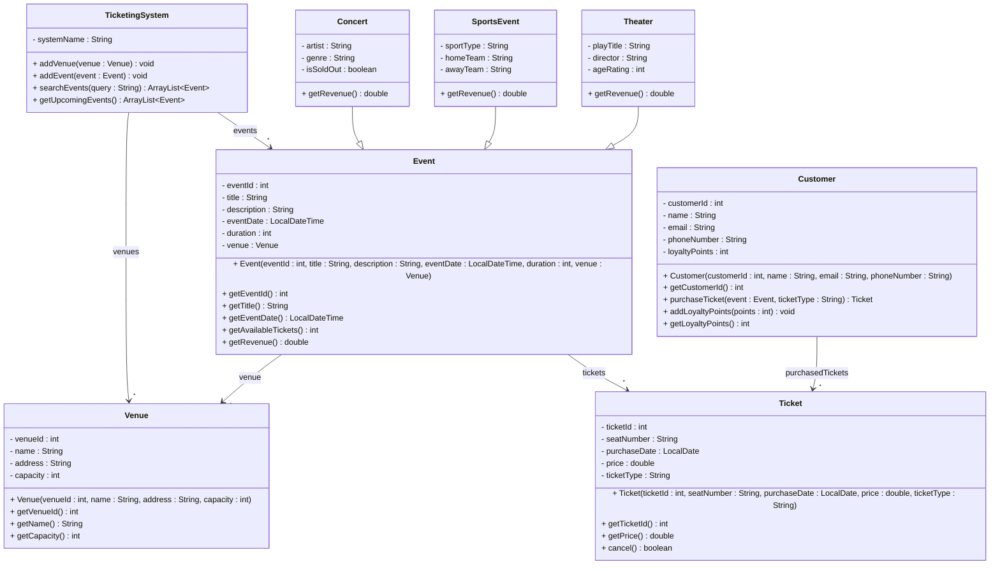

# Exercise 24 - Event Ticketing System

Implement the following class diagram in Java:

## Notes:
- Ticket types: "Standard" (base price), "VIP" (3x base price), "Student" (0.5x base price), "Child" (0.3x base price)
- Concert base ticket price: 500 kr
- Sports event base ticket price: 300 kr
- Theater base ticket price: 400 kr
- Customers earn 1 loyalty point per 100 kr spent
- Events can be cancelled up to 48 hours before event date
- Use `java.time.LocalDateTime` for event dates and `java.time.LocalDate` for purchase dates

