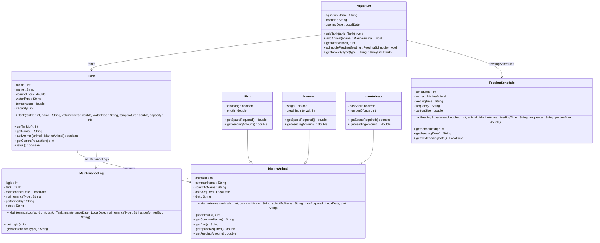

# Exercise 25 - Aquarium Management System

Implement the following class diagram in Java:

## Notes:
- Fish require 1 liter per cm of length, schooling fish need minimum 5 of same species
- Mammals require 1000 liters per kg of weight
- Invertebrates require 5 liters base space
- Fish feeding: 2% of body weight (estimated from length)
- Mammal feeding: 5% of body weight
- Invertebrate feeding: 10 grams per individual
- Water types: "Freshwater", "Saltwater", "Brackish"
- Maintenance types: "Water Change", "Filter Cleaning", "Temperature Check", "Health Inspection"
- Frequency: "Daily", "Weekly", "Monthly"
- Use `java.time.LocalDate` for dates

