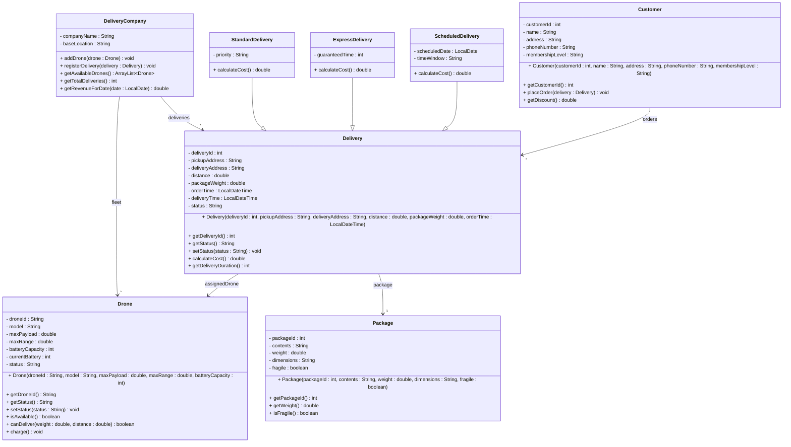

# Exercise 26 - Drone Delivery System

Implement the following class diagram in Java:

## Notes:
- Drone status: "Available", "In Flight", "Charging", "Maintenance"
- Delivery status: "Pending", "In Transit", "Delivered", "Cancelled"
- Standard delivery cost: 50 kr base + 5 kr per km
- Express delivery cost: 150 kr base + 10 kr per km
- Scheduled delivery cost: 80 kr base + 7 kr per km
- Fragile packages add 30 kr surcharge
- Membership levels: "Basic" (no discount), "Premium" (10% discount), "VIP" (25% discount)
- Drone battery drains 1% per km traveled
- Delivery duration estimated at 2 minutes per km
- Use `java.time.LocalDateTime` for timestamps and `java.time.LocalDate` for scheduled dates

