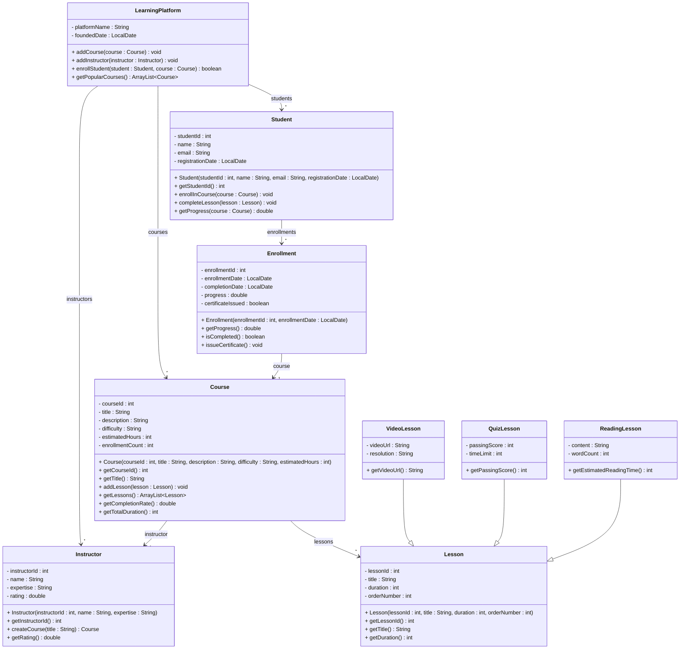

# Exercise 27 - E-Learning Platform System

Implement the following class diagram in Java:

## Notes:
- Difficulty levels: "Beginner", "Intermediate", "Advanced", "Expert"
- Reading time estimated at 200 words per minute
- Course is considered popular if enrollment count > 100
- Certificate issued when progress reaches 100%
- Progress = (completed lessons / total lessons) * 100
- Courses with completion rate > 80% are highly rated
- Use `java.time.LocalDate` for dates

