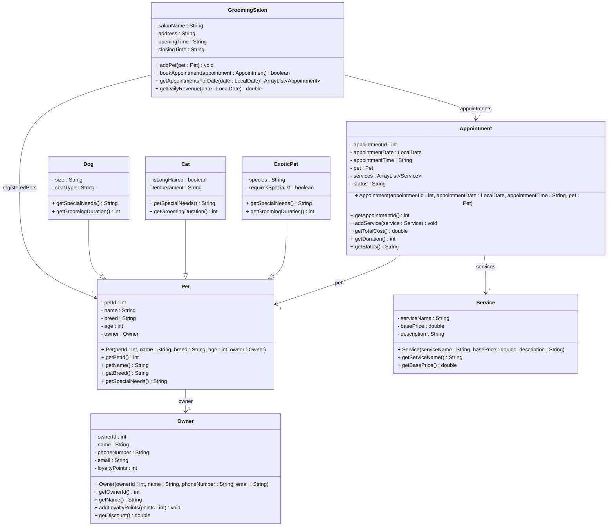

# Exercise 28 - Pet Grooming Salon System

Implement the following class diagram in Java:

## Notes:
- Dog sizes: "Small" (< 10kg), "Medium" (10-25kg), "Large" (> 25kg)
- Dog grooming duration: Small: 60 min, Medium: 90 min, Large: 120 min (add 30 min for long coat)
- Cat grooming duration: 45 min for short hair, 75 min for long hair
- Exotic pet grooming duration: 90 min minimum
- Service types: "Bath" (150 kr), "Haircut" (250 kr), "Nail Trim" (50 kr), "Teeth Cleaning" (100 kr)
- Large dogs have 20% surcharge on all services
- Exotic pets have 50% surcharge
- Owners with 100+ loyalty points get 10% discount
- Earn 1 loyalty point per 10 kr spent
- Appointment status: "Scheduled", "Completed", "Cancelled", "No-Show"
- Use `java.time.LocalDate` for appointment dates

