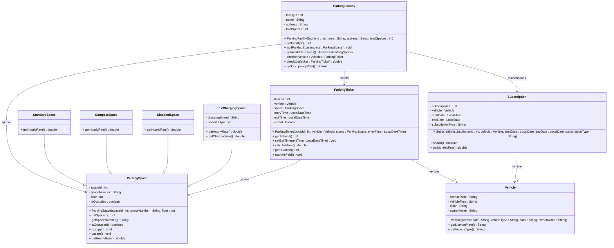

# Exercise 30 - Parking Management System

Implement the following class diagram in Java:

## Notes:
- Hourly rates: Standard: 20 kr, Compact: 15 kr, Disabled: 10 kr, EV Charging: 25 kr
- EV charging fee: 5 kr per kWh (Fast: 50 kW, Rapid: 150 kW, Ultra-rapid: 350 kW)
- First 15 minutes are free
- Maximum daily rate: 200 kr
- Vehicle types: "Car", "Motorcycle", "Bicycle", "Truck"
- Motorcycles and bicycles get 50% discount
- Subscription types: "Monthly" (1000 kr), "Quarterly" (2700 kr, 10% discount), "Annual" (10,800 kr, 20% discount)
- Subscription holders park for free
- Occupancy rate = (occupied spaces / total spaces) * 100
- Duration calculated in minutes
- Use `java.time.LocalDateTime` for entry/exit times and `java.time.LocalDate` for subscriptions

