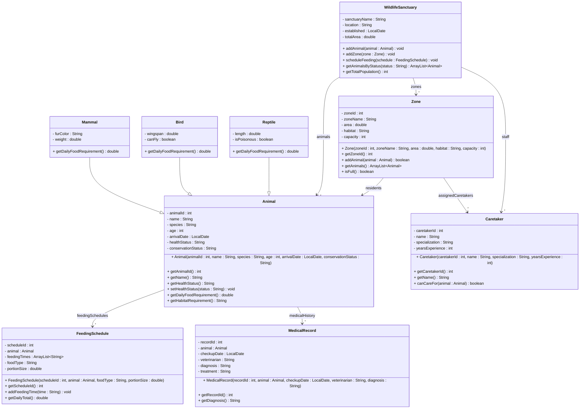

# Exercise 31 - Wildlife Sanctuary System

Implement the following class diagram in Java:

## Notes:
- Mammals: daily food = 3% of body weight (kg)
- Birds: daily food = 10% of body weight (estimated 1kg per 50cm wingspan)
- Reptiles: daily food = 5% of body weight (estimated 2kg per meter)
- Conservation status: "Extinct in Wild", "Critically Endangered", "Endangered", "Vulnerable", "Near Threatened", "Least Concern"
- Health status: "Excellent", "Good", "Fair", "Poor", "Critical"
- Habitat types: "Forest", "Grassland", "Wetland", "Desert", "Mountain"
- Caretaker specializations must match habitat type
- Endangered animals require caretakers with 5+ years experience
- Zone capacity based on animal size and habitat requirements
- Use `java.time.LocalDate` for dates

