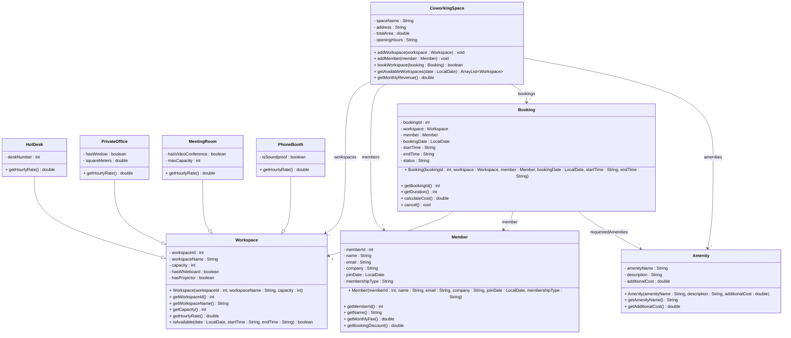

# Exercise 32 - Coworking Space System

Implement the following class diagram in Java:

## Notes:
- Hot desk: 50 kr/hour
- Private office: 150 kr/hour + 20 kr per square meter
- Meeting room: 200 kr/hour, +50 kr if video conference equipment
- Phone booth: 30 kr/hour
- Membership types: "Day Pass" (200 kr/day, no discount), "Part-Time" (1500 kr/month, 10% discount), "Full-Time" (3000 kr/month, 25% discount)
- Amenities: "Coffee" (20 kr), "Printing" (2 kr/page), "Locker" (100 kr/month), "Mail Handling" (150 kr/month)
- Booking status: "Confirmed", "Cancelled", "Completed", "No-Show"
- Cancellation allowed up to 24 hours before booking
- Duration calculated in hours (minimum 1 hour)
- Use `java.time.LocalDate` for dates

