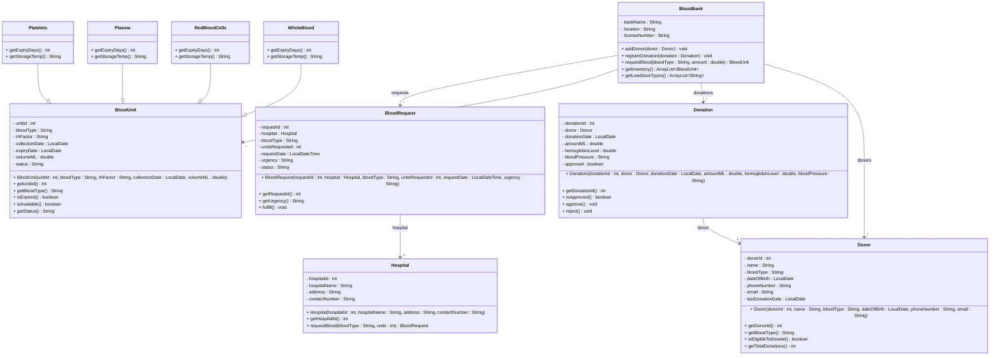

# Exercise 33 - Blood Bank System

Implement the following class diagram in Java:

## Notes:
- Blood types: A+, A-, B+, B-, AB+, AB-, O+, O-
- Donors must wait 56 days between whole blood donations, 112 days for double red cells
- Minimum hemoglobin: 12.5 g/dL for women, 13.0 g/dL for men
- Donors must be 18+ years old
- Expiry periods: Whole blood (35 days), Red cells (42 days), Plasma (1 year frozen), Platelets (5 days)
- Storage temperatures: Whole blood (1-6°C), Red cells (1-6°C), Plasma (-18°C or below), Platelets (20-24°C)
- Low stock: < 20 units of any blood type
- Request urgency: "Emergency" (< 2 hours), "Urgent" (< 24 hours), "Routine" (< 72 hours)
- Request status: "Pending", "Fulfilled", "Partially Fulfilled", "Cancelled"
- Blood unit status: "Available", "Reserved", "Transfused", "Expired", "Discarded"
- Use `java.time.LocalDate` for dates and `java.time.LocalDateTime` for request timestamps

