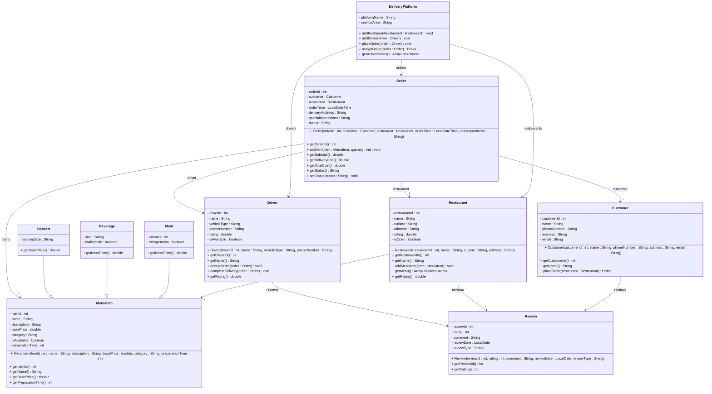

# Exercise 34 - Food Delivery Platform System

Implement the following class diagram in Java:

## Notes:
- Menu categories: "Appetizer", "Main Course", "Side Dish", "Dessert", "Beverage"
- Beverage sizes: "Small" (base price), "Medium" (+10 kr), "Large" (+20 kr)
- Delivery fee: 25 kr base + 5 kr per km from restaurant
- Platform fee: 15% of subtotal
- Order status: "Placed", "Accepted", "Preparing", "Ready", "Out for Delivery", "Delivered", "Cancelled"
- Minimum order: 50 kr
- Free delivery for orders > 200 kr
- Review types: "Restaurant", "Driver", "Food Quality"
- Rating scale: 1-5 stars
- Driver vehicle types: "Bicycle", "Scooter", "Car"
- Estimated delivery time: preparation time + (distance / speed)
  - Bicycle: 15 km/h
  - Scooter: 30 km/h
  - Car: 40 km/h
- Use `java.time.LocalDateTime` for order times and `java.time.LocalDate` for review dates

