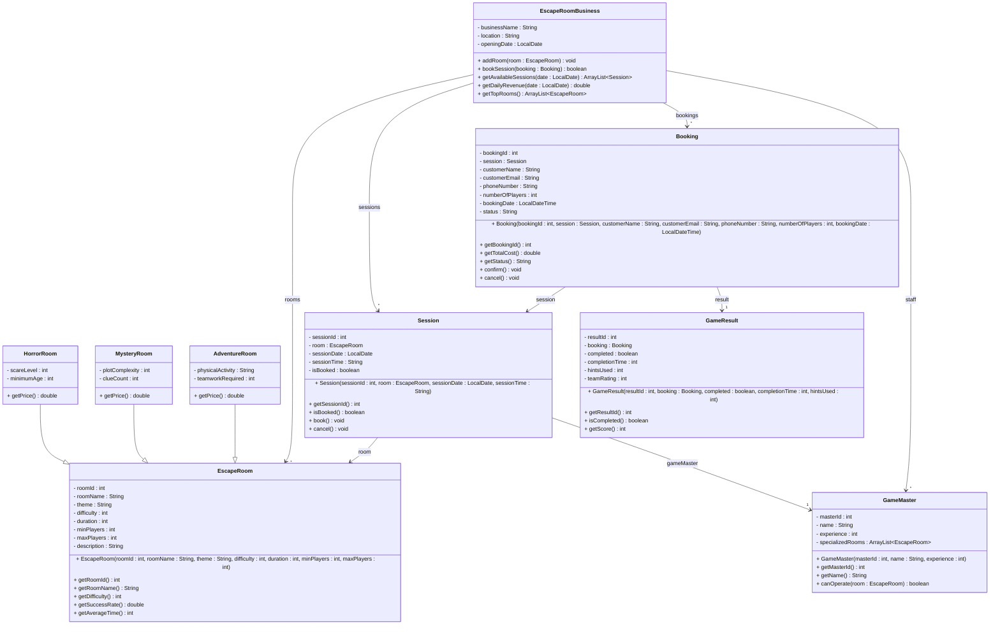

# Exercise 35 - Escape Room Business System

Implement the following class diagram in Java:

## Notes:
- Difficulty scale: 1 (Easy) to 10 (Extreme)
- Horror rooms: 400 kr base + 50 kr per scare level, minimum age 16 for scare level > 5
- Mystery rooms: 350 kr base + 30 kr per difficulty level
- Adventure rooms: 450 kr base + 20 kr per player if physical activity is "High"
- Physical activity levels: "Low", "Medium", "High"
- Price per player, calculated based on room type
- Group discounts: 10% for 6+ players
- Weekend surcharge: +25%
- Booking status: "Pending", "Confirmed", "Completed", "Cancelled", "No-Show"
- Score calculation: (difficulty * 100) - (hintsUsed * 10) - (completionTime minutes)
- Success rate: (completed games / total games) * 100
- Game masters need 10+ games experience for difficulty 8+ rooms
- Cancellation allowed up to 48 hours before session
- Use `java.time.LocalDate` for session dates and `java.time.LocalDateTime` for booking timestamps

