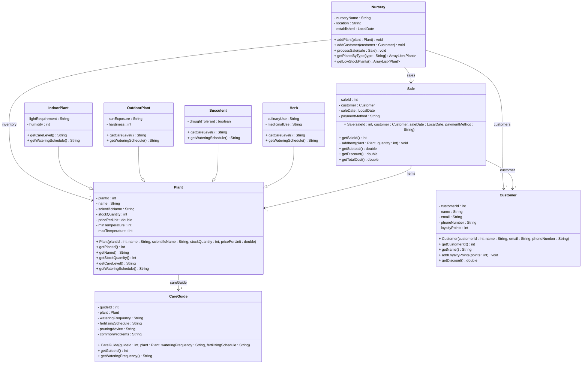

# Exercise 36 - Plant Nursery System

Implement the following class diagram in Java:

## Notes:
- Light requirements: "Low", "Medium", "Bright Indirect", "Direct Sun"
- Sun exposure: "Full Sun", "Partial Shade", "Full Shade"
- Watering schedules: "Daily", "Every 2-3 days", "Weekly", "Every 2 weeks", "Monthly"
- Care levels: "Easy" (succulents, hardy plants), "Moderate" (most plants), "Difficult" (orchids, carnivorous plants)
- Hardiness zones: 1-13 (lower = more cold-hardy)
- Indoor plants +20% markup if low light requirement
- Outdoor plants -10% discount if hardiness < 6
- Herbs +15% markup if both culinary and medicinal use
- Succulents base price (easy care)
- Low stock warning: < 10 units
- Loyalty points: 1 point per 10 kr spent
- Customer discounts: 100+ points = 5%, 500+ points = 10%, 1000+ points = 15%
- Payment methods: "Cash", "Card", "Mobile Pay"
- Use `java.time.LocalDate` for dates

