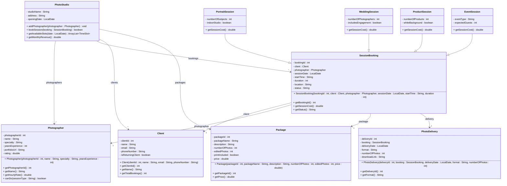

# Exercise 37 - Photography Studio System

Implement the following class diagram in Java:

## Notes:
- Portrait session: 1000 kr/hour + 200 kr per additional subject beyond first
- Wedding session: 5000 kr base + 3000 kr per additional photographer, +1000 kr if includes engagement shoot
- Product session: 800 kr/hour + 50 kr per product, +300 kr for studio setup if white background
- Event session: 1500 kr/hour + 10 kr per expected guest
- Photographer hourly rate: 500 kr base + 100 kr per year of experience
- Photographer specialty must match session type
- Returning client discount: 10%
- Booking status: "Pending", "Confirmed", "Completed", "Cancelled"
- Package tiers: "Basic" (50 photos, 10 edited, 1500 kr), "Standard" (100 photos, 30 edited, 3000 kr), "Premium" (200 photos, 50 edited, prints, 5000 kr)
- Delivery formats: "Digital Download", "USB Drive" (+100 kr), "Cloud Storage" (+50 kr/month)
- Photos delivered within 14 days of session
- Cancellation allowed up to 72 hours before session (50% refund)
- Use `java.time.LocalDate` for dates

