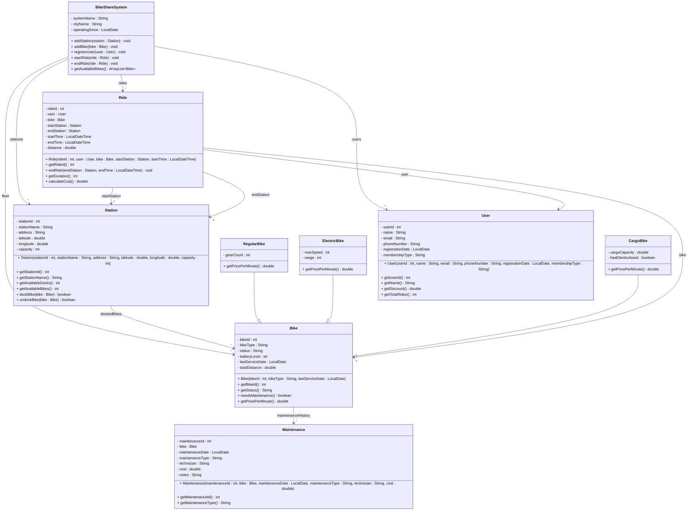

# Exercise 39 - Bike Sharing System

Implement the following class diagram in Java:

## Notes:
- Regular bike: 2 kr/minute
- Electric bike: 3 kr/minute, needs charging when battery < 20%
- Cargo bike: 4 kr/minute, 5 kr/minute if electric assist
- Bike status: "Available", "In Use", "Maintenance", "Charging", "Damaged"
- Membership types: "Pay Per Ride" (no discount), "Monthly" (1000 kr/month, 20% discount), "Annual" (10000 kr/year, 30% discount)
- First 5 minutes free for all rides
- Distance calculated from GPS coordinates
- Bikes need maintenance after 1000 km or 90 days since last service
- Maintenance types: "Regular Service", "Repair", "Battery Replacement", "Tire Change"
- Station is full when available docks = 0
- Station is empty when available bikes = 0
- Peak hour surcharge (7-9 AM, 4-6 PM): +50%
- Night discount (10 PM - 6 AM): -25%
- Duration calculated in minutes
- Use `java.time.LocalDateTime` for ride times and `java.time.LocalDate` for dates

