# Exercise 40 - Board Game Café System

Implement the following class diagram in Java:

```mermaid
classDiagram
    class BoardGameCafe {
        - cafeName : String
        - address : String
        - capacity : int
        - openingDate : LocalDate
        + addGame(game : BoardGame) void
        + addTable(table : Table) void
        + makeReservation(reservation : Reservation) boolean
        + processOrder(order : Order) void
        + getAvailableTables(date : LocalDate, time : String) ArrayList~Table~
    }
    
    class BoardGame {
        - gameId : int
        - title : String
        - publisher : String
        - minPlayers : int
        - maxPlayers : int
        - playingTime : int
        - difficulty : String
        - availability : boolean
        + BoardGame(gameId : int, title : String, publisher : String, minPlayers : int, maxPlayers : int, playingTime : int, difficulty : String)
        + getGameId() int
        + getTitle() String
        + isAvailable() boolean
        + getCategory() String
    }
    
    class StrategyGame {
        - complexity : int
        - hasExpansions : boolean
        + getCategory() String
    }
    
    class PartyGame {
        - ageRating : int
        - isTeamBased : boolean
        + getCategory() String
    }
    
    class FamilyGame {
        - educationalValue : boolean
        - recommendedAge : int
        + getCategory() String
    }
    
    class Table {
        - tableNumber : int
        - capacity : int
        - hasGameStorage : boolean
        - location : String
        + Table(tableNumber : int, capacity : int, hasGameStorage : boolean, location : String)
        + getTableNumber() int
        + getCapacity() int
        + isAvailable() boolean
    }
    
    class Reservation {
        - reservationId : int
        - customerName : String
        - customerEmail : String
        - phoneNumber : String
        - reservationDate : LocalDate
        - reservationTime : String
        - numberOfPeople : int
        - table : Table
        - duration : int
        - status : String
        + Reservation(reservationId : int, customerName : String, customerEmail : String, phoneNumber : String, reservationDate : LocalDate, reservationTime : String, numberOfPeople : int)
        + getReservationId() int
        + addGame(game : BoardGame) void
        + calculateTableFee() double
        + getStatus() String
    }
    
    class MenuItem {
        - itemId : int
        - name : String
        - category : String
        - price : double
        - description : String
        + MenuItem(itemId : int, name : String, category : String, price : double, description : String)
        + getItemId() int
        + getName() String
        + getPrice() double
    }
    
    class Order {
        - orderId : int
        - reservation : Reservation
        - orderTime : LocalDateTime
        + Order(orderId : int, reservation : Reservation, orderTime : LocalDateTime)
        + getOrderId() int
        + addItem(item : MenuItem, quantity : int) void
        + getSubtotal() double
        + getTotalCost() double
    }
    
    class Event {
        - eventId : int
        - eventName : String
        - eventDate : LocalDate
        - startTime : String
        - maxParticipants : int
        - entryFee : double
        - description : String
        + Event(eventId : int, eventName : String, eventDate : LocalDate, startTime : String, maxParticipants : int, entryFee : double)
        + getEventId() int
        + registerParticipant(name : String) boolean
        + isFull() boolean
    }
    
    BoardGameCafe --> "*" BoardGame : gameLibrary
    BoardGameCafe --> "*" Table : tables
    BoardGameCafe --> "*" Reservation : reservations
    BoardGameCafe --> "*" MenuItem : menu
    BoardGameCafe --> "*" Event : events
    StrategyGame --|> BoardGame
    PartyGame --|> BoardGame
    FamilyGame --|> BoardGame
    Reservation --> "1" Table : table
    Reservation --> "*" BoardGame : requestedGames
    Order --> "1" Reservation : reservation
    Order --> "*" MenuItem : items
```

## Notes:
- Table fee: 50 kr per person for first 2 hours, then 20 kr/hour per person
- Weekend surcharge: +25% on table fee
- Minimum order: 50 kr of food/drinks per person
- Game categories: "Strategy", "Party", "Family", "Card", "Dice", "Cooperative"
- Difficulty levels: "Light" (1-2), "Medium" (3-4), "Heavy" (5+)
- Menu categories: "Hot Drinks", "Cold Drinks", "Snacks", "Sandwiches", "Desserts"
- Reservation duration: default 2 hours, maximum 4 hours
- Reservation status: "Confirmed", "In Progress", "Completed", "Cancelled", "No-Show"
- Table locations: "Window", "Corner", "Center", "Quiet Zone"
- Game library size: track total count and available count
- Events: tournaments, game nights, learn-to-play sessions
- Event types: "Tournament" (competitive), "Social Play" (casual), "Tutorial" (learning)
- Tables with game storage are preferred for longer sessions
- Cancellation allowed up to 24 hours before reservation
- Use `java.time.LocalDate` for dates and `java.time.LocalDateTime` for order timestamps

