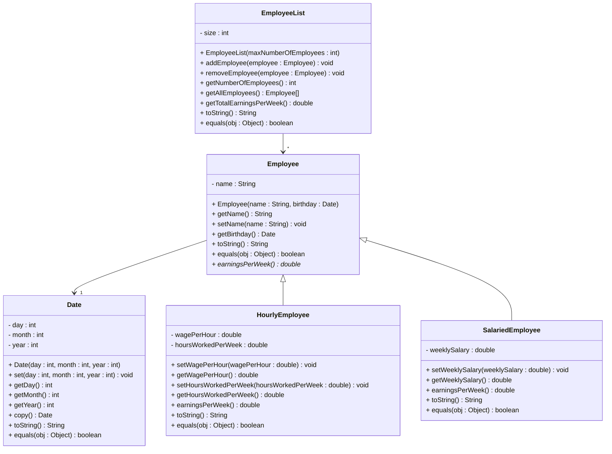

# Exercise 41 - Employee Management System

Implement the following class diagram in Java:

## Notes:
- The `earningsPerWeek()` method in `Employee` is abstract (marked with *)
- For `HourlyEmployee`, earnings = wagePerHour × hoursWorkedPerWeek
- For `SalariedEmployee`, earnings = weeklySalary
- `EmployeeList` should track all employees and calculate total weekly earnings
- The birthday is stored as a `Date` object
- Implement `equals()` to compare employees by name and birthday
- Implement `toString()` to provide meaningful string representations

