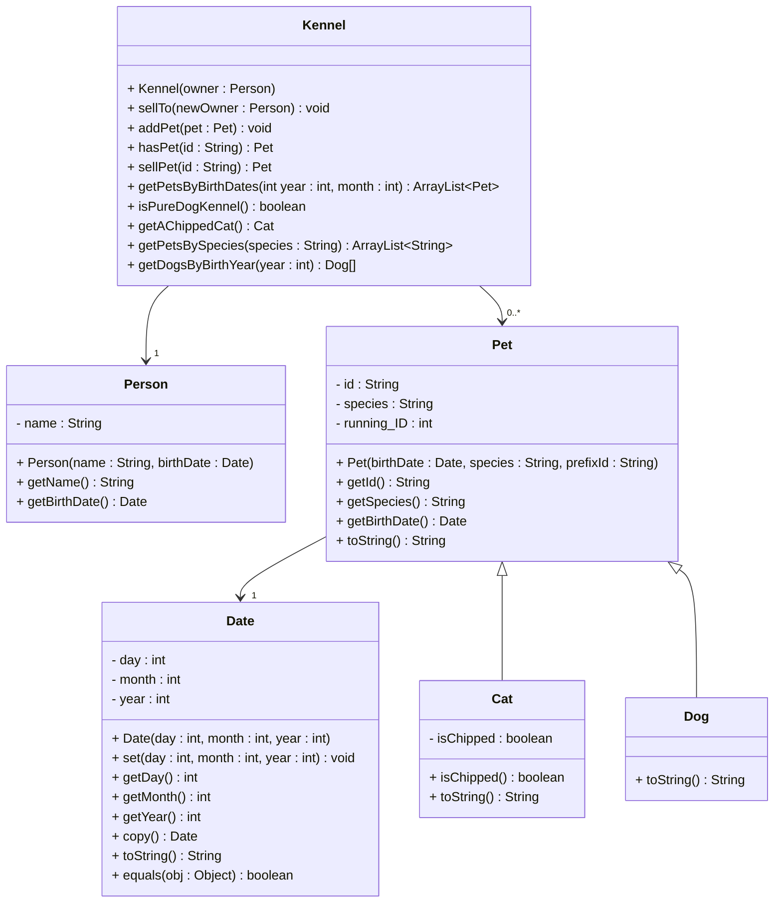

# Exercise 42 - Kennel Management System

Implement the following class diagram in Java:

## Notes:
- The `id` is generated using a prefix and a running ID counter (e.g., "Cat0001", "Dog0003")
- The prefix should be based on the species (e.g., "Cat" for cats, "Dog" for dogs)
- `running_ID` is a static counter that increments for each new pet (shared across all pets)
- `isPureDogKennel()` returns true if the kennel contains only dogs (no cats or other species)
- `getAChippedCat()` returns any one cat that is chipped, or null if none exist
- `getPetsByBirthDates()` returns pets born in the specified month and year
- `getDogsByBirthYear()` returns an array of all dogs born in the specified year
- Use `java.time.LocalDate` for date handling in your implementation (the Date class in the diagram is a custom class for practice)

