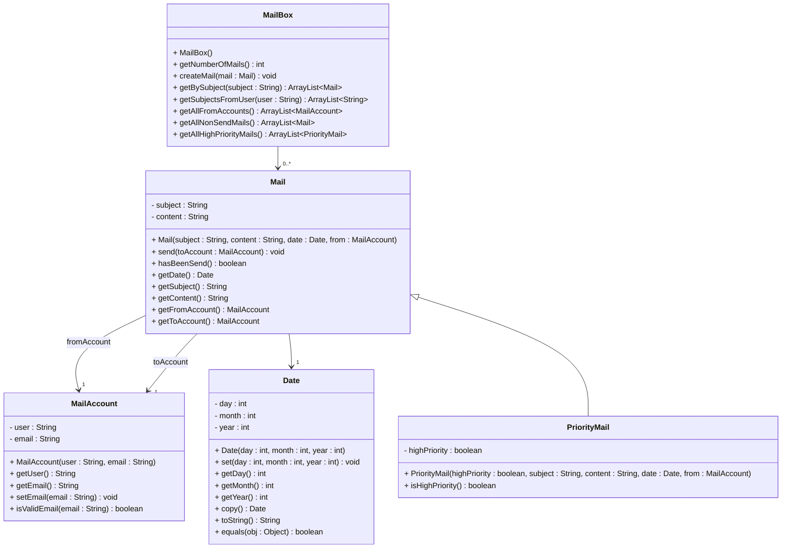

# Exercise 43 - Mail System

Implement the following class diagram in Java:

## Notes:
- A mail is considered "sent" after the `send()` method has been called
- `hasBeenSend()` returns whether the mail has been sent (toAccount is not null)
- `getAllNonSendMails()` returns all mails where `hasBeenSend()` returns false
- `getAllHighPriorityMails()` returns only `PriorityMail` objects where `isHighPriority()` is true
- `isValidEmail()` should check that the email contains "@" and has at least one character before and after it
- `getBySubject()` returns all mails with a matching subject (case-sensitive)
- `getSubjectsFromUser()` returns all unique subjects from mails sent by the specified user
- `getAllFromAccounts()` returns all unique MailAccount objects that have sent at least one mail
- Use `java.time.LocalDate` for date handling in your implementation (the Date class in the diagram is a custom class for practice)
- Priority mails are only high priority if `highPriority` is true

