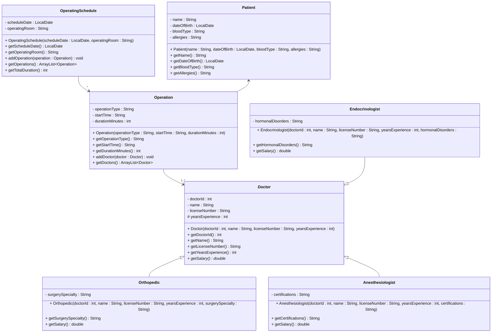

# Exercise 14 - Hospital Management System

Implement the following class diagram in Java:

## Notes:
- Use `java.time.LocalDate` for dates
- The `addDoctor()` method throws an `IllegalStateException` if a doctor of the same type (class) is already assigned to the operation
  - For example, you cannot add two Orthopedic doctors to the same operation, but you can have one Orthopedic and one Anesthesiologist
- Operation types can be: "Knee Replacement", "Hip Surgery", "Appendectomy", "Thyroidectomy", etc.
- Orthopedic surgery specialties can be: "Knees", "Elbows", "Hips", "Spine", etc.
- Orthopedic doctors earn 800,000 kr per year base salary + 50,000 kr per year of experience
- Anesthesiologists earn 900,000 kr per year base salary + 60,000 kr per year of experience
- Endocrinologists earn 750,000 kr per year base salary + 45,000 kr per year of experience, and an extra bonus of 10,000 per 5 years of experience
