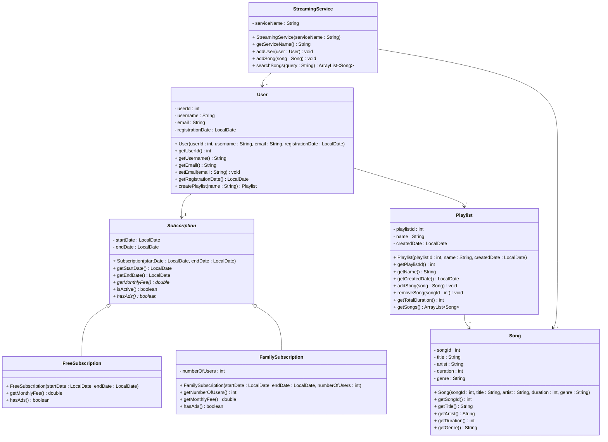

# Exercise 16 - Music Streaming System

Implement the following class diagram in Java:

## Notes:
- `getMonthlyFee()` and `hasAds()` in `Subscription` are abstract (marked with *)
- Free subscription costs 0 kr, has ads
- Family subscription costs 149 kr per month for up to 6 users, no ads
- `isActive()` returns true if the current date is between startDate and endDate
- Use `java.time.LocalDate` for date handling

## Extensions:

### StreamingService
- **Current fields:** `serviceName : String`
- **Possible extensions:** `foundedYear : int`, `totalUsers : int`, `totalSongs : int`, `monthlyRevenue : double`, `country : String`, `supportedDevices : ArrayList<String>`

### User
- **Current fields:** `userId : int`, `username : String`, `email : String`, `registrationDate : LocalDate`
- **Possible extensions:** `password : String`, `dateOfBirth : LocalDate`, `country : String`, `preferredLanguage : String`, `totalPlaytime : int`, `favoriteGenres : ArrayList<String>`, `lastLoginDate : LocalDate`

### Subscription (abstract)
- **Current fields:** `startDate : LocalDate`, `endDate : LocalDate`
- **Possible extensions:** `autoRenew : boolean`, `paymentMethod : String`, `discountCode : String`, `cancellationDate : LocalDate`
- **Current subclasses:** `FreeSubscription`, `FamilySubscription`
- **Possible subclasses:** `PremiumSubscription`, `StudentSubscription`, `TrialSubscription`, `CorporateSubscription`, `AnnualSubscription`

### FreeSubscription
- **Current fields:** (inherits from Subscription)
- **Possible extensions:** `adFrequency : int`, `skipLimit : int`, `offlineDownload : boolean`

### FamilySubscription
- **Current fields:** `numberOfUsers : int`
- **Possible extensions:** `maxUsers : int`, `parentAccountId : int`, `childAccounts : ArrayList<User>`, `parentalControls : boolean`

### Song
- **Current fields:** `songId : int`, `title : String`, `artist : String`, `duration : int`, `genre : String`
- **Possible extensions:** `album : String`, `releaseDate : LocalDate`, `playCount : int`, `likes : int`, `fileSize : long`, `bitrate : int`, `lyrics : String`, `featuredArtists : ArrayList<String>`

### Playlist
- **Current fields:** `playlistId : int`, `name : String`, `createdDate : LocalDate`
- **Possible extensions:** `description : String`, `isPublic : boolean`, `playCount : int`, `followers : int`, `coverImage : String`, `lastModifiedDate : LocalDate`, `tags : ArrayList<String>`

