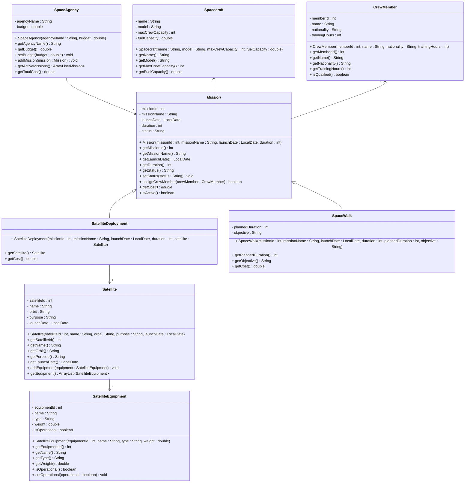

# Exercise 17 - Space Mission System

Implement the following class diagram in Java:

## Notes:
- `getCost()` in `Mission` is abstract (marked with *)
- Satellite deployment missions cost 500 million kr
- Space walk missions cost 200 million kr plus 10 million kr per hour of planned duration
- Crew members need at least 1000 training hours to be qualified
- Mission status can be: "Planned", "Active", "Completed", "Aborted"
- Use `java.time.LocalDate` for launch dates
- Satellite equipment types can be: "Communication", "Imaging", "Navigation", "Scientific", "Power", "Propulsion"

## Extensions:

### SpaceAgency
- **Current fields:** `agencyName : String`, `budget : double`
- **Possible extensions:** `foundedYear : int`, `country : String`, `totalMissions : int`, `successfulMissions : int`, `headquarters : String`, `director : String`, `partnerships : ArrayList<String>`

### Mission (abstract)
- **Current fields:** `missionId : int`, `missionName : String`, `launchDate : LocalDate`, `duration : int`, `status : String`
- **Possible extensions:** `endDate : LocalDate`, `budget : double`, `priority : String`, `objectives : ArrayList<String>`, `risks : ArrayList<String>`, `backupPlan : String`
- **Current subclasses:** `SatelliteDeployment`, `SpaceWalk`
- **Possible subclasses:** `PlanetaryExploration`, `SpaceStationResupply`, `AsteroidMining`, `TelescopeDeployment`, `MarsColonization`, `LunarLanding`

### CrewMember
- **Current fields:** `memberId : int`, `name : String`, `nationality : String`, `trainingHours : int`
- **Possible extensions:** `dateOfBirth : LocalDate`, `role : String`, `specialization : String`, `missionsCompleted : int`, `certifications : ArrayList<String>`, `medicalClearance : boolean`, `emergencyContact : String`

### Spacecraft
- **Current fields:** `name : String`, `model : String`, `maxCrewCapacity : int`, `fuelCapacity : double`
- **Possible extensions:** `manufacturer : String`, `launchYear : int`, `status : String`, `totalMissions : int`, `weight : double`, `maxSpeed : double`, `equipment : ArrayList<String>`

### Satellite
- **Current fields:** `satelliteId : int`, `name : String`, `orbit : String`, `purpose : String`, `launchDate : LocalDate`
- **Possible extensions:** `satelliteType : String`, `expectedLifespan : int`, `powerSource : String`, `communicationBand : String`, `status : String`, `operator : String`, `altitude : double`

### SatelliteEquipment
- **Current fields:** `equipmentId : int`, `name : String`, `type : String`, `weight : double`, `isOperational : boolean`
- **Possible extensions:** `manufacturer : String`, `powerConsumption : double`, `lastMaintenanceDate : LocalDate`, `warrantyExpiry : LocalDate`, `specifications : String`

### SatelliteDeployment
- **Current fields:** `satellite : Satellite`
- **Possible extensions:** `deploymentMethod : String`, `deploymentAltitude : double`, `deploymentSuccess : boolean`

### SpaceWalk
- **Current fields:** `plannedDuration : int`, `objective : String`
- **Possible extensions:** `actualDuration : int`, `safetyRating : int`, `equipmentUsed : ArrayList<String>`, `challengesEncountered : String`, `suitType : String`

