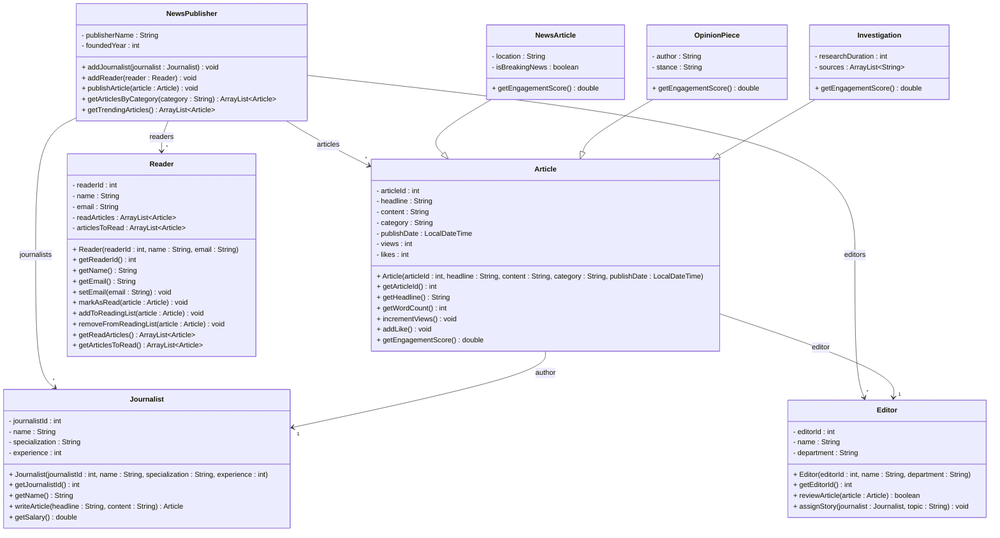

# Exercise 29 - News Publisher System

Implement the following class diagram in Java:

## Notes:
- Categories: "Politics", "Business", "Technology", "Sports", "Entertainment", "Science"
- Engagement score = (views * 1) + (likes * 5)
- Breaking news articles get 2x engagement multiplier
- Trending articles have engagement score > 1000
- Journalist salary: 30,000 kr base + 1,000 kr per year of experience
- Investigations require minimum 5 years experience
- Use `java.time.LocalDateTime` for publish dates

## Extensions:

### NewsPublisher
- **Current fields:** `publisherName : String`, `foundedYear : int`
- **Possible extensions:** `headquarters : String`, `totalArticles : int`, `totalReaders : int`, `revenue : double`, `editorialPolicy : String`, `awards : ArrayList<String>`, `website : String`

### Article
- **Current fields:** `articleId : int`, `headline : String`, `content : String`, `category : String`, `publishDate : LocalDateTime`, `views : int`, `likes : int`
- **Possible extensions:** `subtitle : String`, `tags : ArrayList<String>`, `readingTime : int`, `imageUrl : String`, `videoUrl : String`, `comments : ArrayList<String>`, `shares : int`, `bookmarks : int`
- **Current subclasses:** `NewsArticle`, `OpinionPiece`, `Investigation`
- **Possible subclasses:** `FeatureArticle`, `Review`, `Interview`, `Editorial`, `Column`, `PhotoEssay`, `VideoArticle`

### NewsArticle
- **Current fields:** `location : String`, `isBreakingNews : boolean`
- **Possible extensions:** `source : String`, `verified : boolean`, `updateCount : int`, `relatedArticles : ArrayList<Article>`

### OpinionPiece
- **Current fields:** `author : String`, `stance : String`
- **Possible extensions:** `argumentStrength : int`, `opposingViews : ArrayList<String>`, `citationCount : int`

### Investigation
- **Current fields:** `researchDuration : int`, `sources : ArrayList<String>`
- **Possible extensions:** `budget : double`, `teamSize : int`, `awardsWon : ArrayList<String>`, `impact : String`, `followUpArticles : ArrayList<Article>`

### Journalist
- **Current fields:** `journalistId : int`, `name : String`, `specialization : String`, `experience : int`
- **Possible extensions:** `email : String`, `phoneNumber : String`, `awards : ArrayList<String>`, `articlesPublished : int`, `beat : String`, `socialMedia : ArrayList<String>`, `education : String`

### Editor
- **Current fields:** `editorId : int`, `name : String`, `department : String`
- **Possible extensions:** `email : String`, `yearsExperience : int`, `articlesEdited : int`, `teamSize : int`, `budget : double`, `specialization : String`

### Reader
- **Current fields:** `readerId : int`, `name : String`, `email : String`, `readArticles : ArrayList<Article>`, `articlesToRead : ArrayList<Article>`
- **Possible extensions:** `registrationDate : LocalDate`, `preferredCategories : ArrayList<String>`, `favoriteAuthors : ArrayList<Journalist>`, `readingStreak : int`, `totalReadingTime : int`, `notificationsEnabled : boolean`

