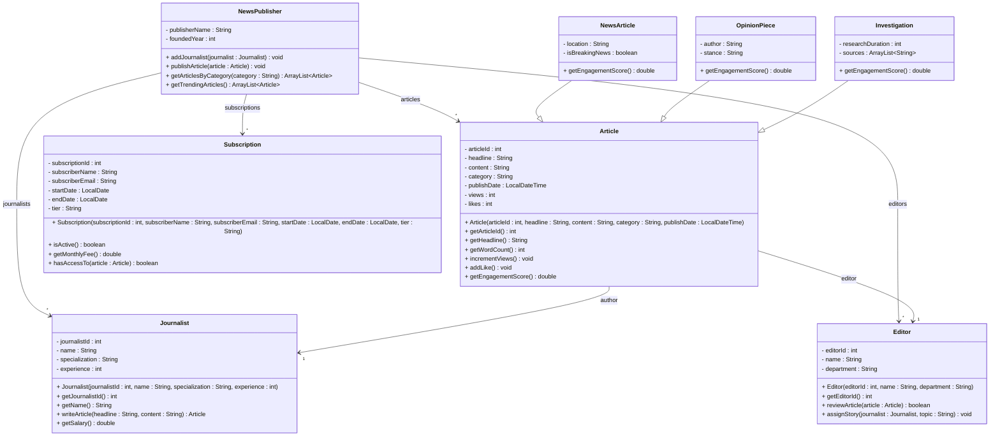

# Exercise 29 - News Publisher System

Implement the following class diagram in Java:

## Notes:
- Categories: "Politics", "Business", "Technology", "Sports", "Entertainment", "Science"
- Engagement score = (views * 1) + (likes * 5)
- Breaking news articles get 2x engagement multiplier
- Trending articles have engagement score > 1000
- Subscription tiers: "Free" (0 kr, access to 5 articles/month), "Basic" (99 kr, unlimited news), "Premium" (199 kr, all content including investigations)
- Journalist salary: 30,000 kr base + 1,000 kr per year of experience
- Investigations require minimum 5 years experience
- Use `java.time.LocalDateTime` for publish dates and `java.time.LocalDate` for subscriptions

